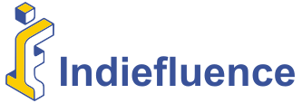

  

# 👋 Welcome to Indiefluence

We’re **Indiefluence** - a creative + tech team that blends **design psychology** with **full-stack web development** to build brands and digital products that stand out.

## 🚀 What We Build

- **Custom Websites & Web Apps**
  From landing pages to complex SaaS platforms, we craft pixel-perfect, high-performance solutions.

- **E-commerce Experiences**
  Scalable stores with optimized product architecture, smooth checkout flows, and integrated analytics.

- **API-Driven Backends**
  Secure, efficient, and built to handle growth - from REST APIs to GraphQL endpoints.

- **Interactive UI/UX**
  Human-centered design meets clean, responsive code for flawless cross-device experiences.

---

## 🛠️ Our Stack

- **Frontend:** Next.js, React, Tailwind CSS
- **Backend:** Node.js, Supabase, AWS Lambda
- **Databases:** PostgreSQL, MongoDB
- **Tooling:** GitHub Actions, Docker, Vercel, NixOS

---

## 💡 How We Work

We don’t just write code - we **engineer experiences**.
Every project is shaped by:

1. **User Psychology** - making products intuitive and conversion-friendly.
2. **Performance First** - speed and scalability are baked in from day one.
3. **Clean Architecture** - maintainable, modular, and future-ready.

---

## 🤝 Let’s Build Something Together

We collaborate with brands, startups, and entrepreneurs to launch **beautiful, functional, and impactful** digital products.

  
  &nbsp;&nbsp;&nbsp;
  
  &nbsp;&nbsp;&nbsp;
  

---

_"Code is our craft, design is our language."_
